# HirePilot

<p align="center">
  <strong>企业招聘中台</strong> · 简历多维评分 · 达标模拟面试 · HR Agent RAG 问答 · 企业级评测门禁
</p>

<p align="center">
  <a href="#快速开始"></a>
  <a href="#快速开始"></a>
  <a href="#技术栈"></a>
  <a href="#rag--评测"></a>
  <a href="LICENSE"></a>
</p>

<p align="center">
  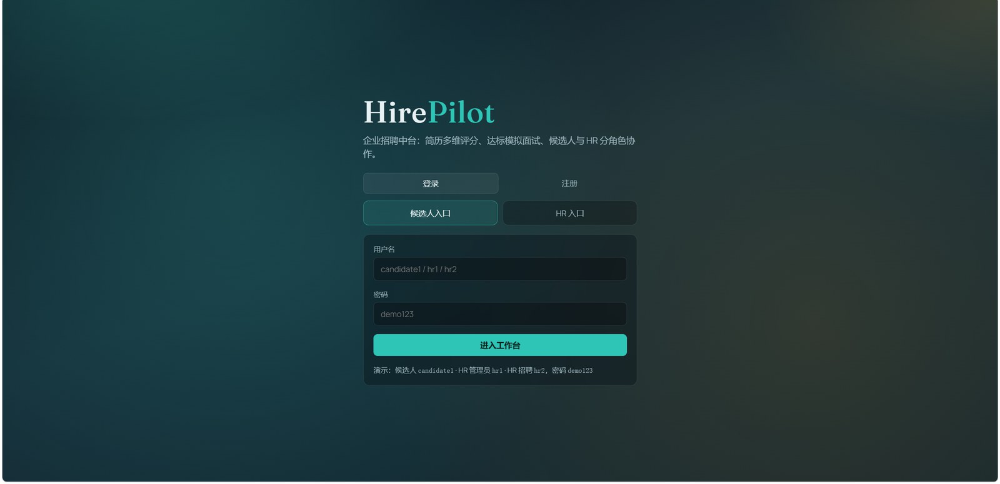
</p>

---

## 为什么做 HirePilot

把「上传简历 → 评分 → 模拟面试 → HR 检索问答 → 运维评测」做成一条可本地跑通的招聘 Agent 流水线，而不是只做 Demo Chat。

| 角色 | 能做什么 |
|------|----------|
| **候选人** | 上传简历、查看多维评分、达标后进入模拟面试 |
| **HR** | 岗位管理、达标看板、管道推进、安排真人面试、Agent 对话检索简历 |
| **运维 (admin)** | `/ops` 独立控制台：RAGAS 评测看板、后端日志（不进入 HR 业务导航） |

---

## 功能亮点

- **多维简历评分**：技能 / 项目 / 教育 / 岗位匹配，组织级权重可调；无 LLM 时回退本地启发式，保证可演示
- **达标门槛**：默认简历分 ≥ 70 解锁模拟面试（`RESUME_SCORE_THRESHOLD`）
- **LangGraph Agent**：简历解析评分、面试对话、HR QA 同一套运行时与 SQLite checkpoint
- **Hybrid RAG**：FAISS 向量 + 关键词 / 姓名优先检索；档案导出默认「仅简历」避免 JD / 面试噪声污染
- **引用溯源**：Agent 回答附 retrieval snippets，便于审计
- **企业级评测门禁**：Golden + 拒答 + 忠实度 / 相关性 / 姓名检索隔离；Ops 看板一键复评
- **多租户与权限**：组织隔离、HR admin / recruiter 分级、PII 脱敏与留存策略
- **通知与导出**：邮件 / 短信通道可开关；候选人 CSV / PDF 导出

---

## 界面预览

> 截图仅裁剪浏览器边框，保留完整界面内容。

### 登录

<p align="center">
  
</p>

### 候选人

<p align="center">
  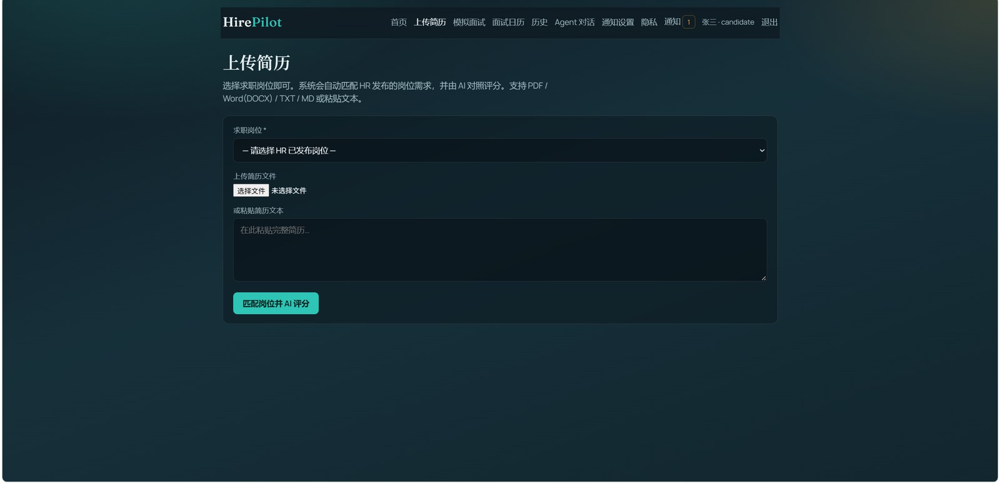
</p>
<p align="center">
  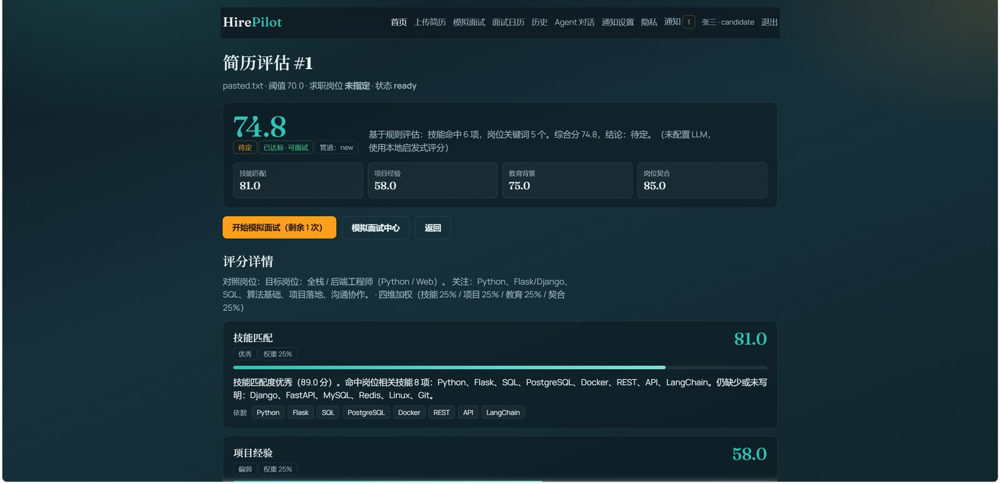
</p>
<p align="center">
  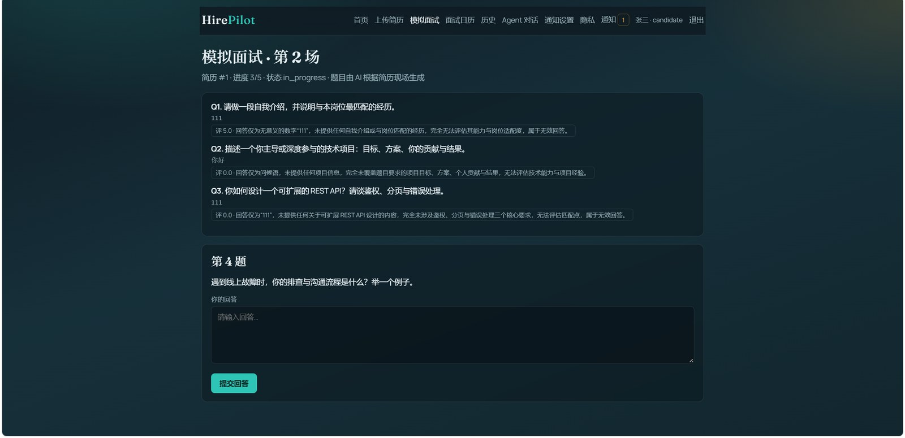
</p>

### HR

<p align="center">
  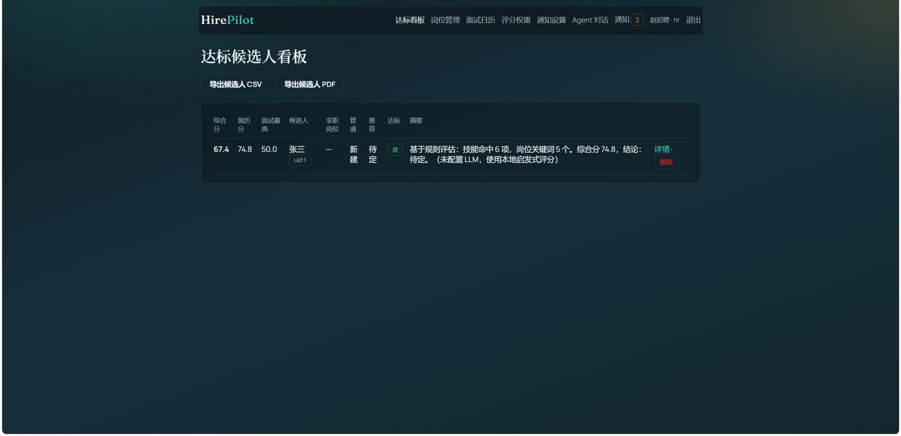
</p>
<p align="center">
  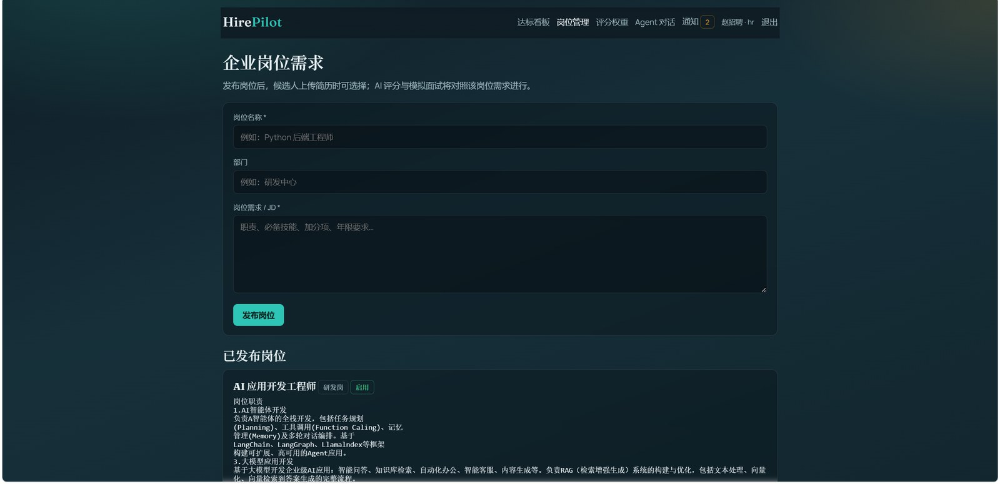
</p>
<p align="center">
  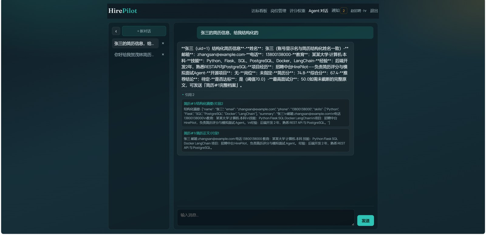
</p>
<p align="center">
  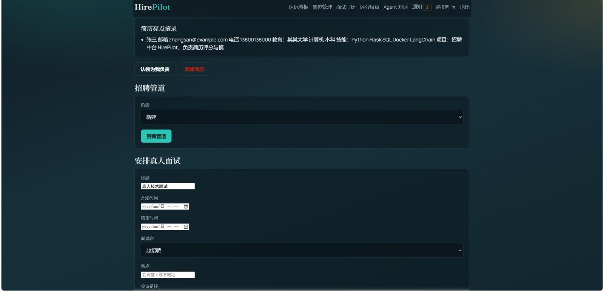
</p>
<p align="center">
  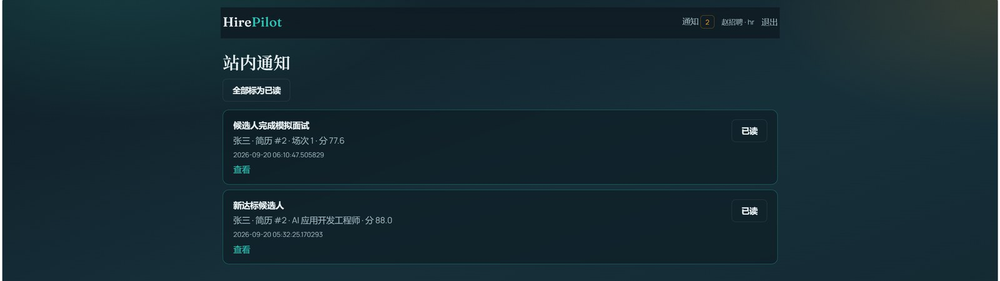
</p>

### 运维

<p align="center">
  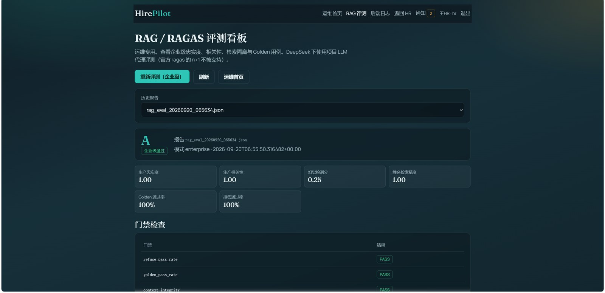
</p>
<p align="center">
  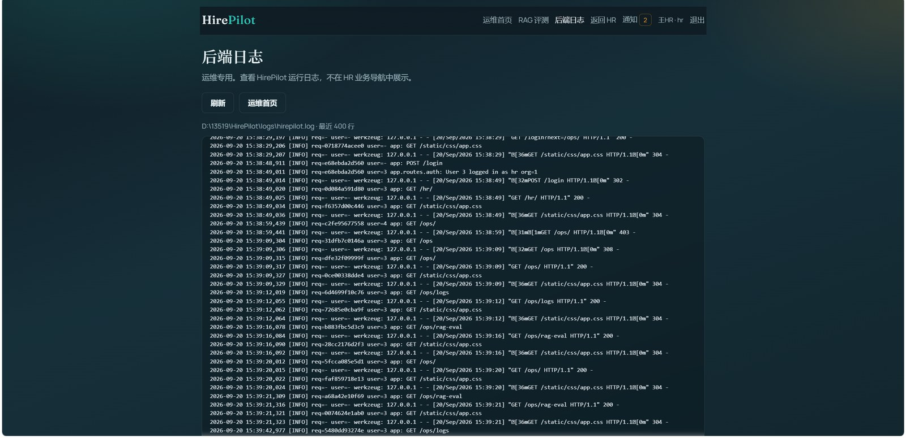
</p>

---

## 架构一览

```text
┌─────────────┐   ┌──────────────┐   ┌──────────────────────────┐
│  Candidate  │   │      HR      │   │   Ops (/ops, admin)      │
│  Upload UI  │   │  Dashboard   │   │  RAG Eval · Logs         │
└──────┬──────┘   └──────┬───────┘   └────────────┬─────────────┘
       │                 │                        │
       └────────────┬────┴────────────────────────┘
                    ▼
            Flask + Flask-Login
                    │
     ┌──────────────┼──────────────┐
     ▼              ▼              ▼
 Resume Agent   Interview     QA Agent (RAG)
 (parse/score)  Agent         Hybrid retrieve
     │              │              │
     └──────────────┼──────────────┘
                    ▼
         LangGraph + SQLite checkpoint
                    │
         ┌──────────┼──────────┐
         ▼          ▼          ▼
      SQLite     FAISS      Job queue
      (biz)     (index)   (inline/worker)
```

---

## 技术栈

- **Web**：Flask 3 · Flask-Login · Flask-Limiter · Jinja2
- **Agent**：LangGraph · LangChain · OpenAI-compatible LLM（DeepSeek 等）
- **RAG**：FAISS · sentence-transformers（可切 API / hash embedding）
- **Eval**：自定义 Golden + RAGAS 兼容代理（DeepSeek `n=1`）
- **存储**：SQLite（业务 + checkpoint）· 本地 uploads

---

## 快速开始

### 1. 环境

```bash
git clone https://github.com/Galaxy527/HirePilot.git
cd HirePilot
python -m venv .venv

# Windows
.venv\Scripts\activate
# macOS / Linux
source .venv/bin/activate

pip install -r requirements.txt
cp .env.example .env
```

### 2. 配置 LLM（可选但推荐）

编辑 `.env`：

```env
LLM_API_KEY=your_key
LLM_BASE_URL=https://api.deepseek.com/v1   # 或 OpenAI 兼容地址
LLM_MODEL=deepseek-chat
EMBEDDING_BACKEND=local
```

不填 `LLM_API_KEY` 时，评分会走本地启发式，Agent 对话能力受限，但业务页面仍可浏览。

### 3. 启动

```bash
python run.py
```

打开 http://127.0.0.1:5000

可选独立 Worker（关闭内联任务时）：

```bash
# .env: HIRING_INLINE_JOBS=0
python -m app.worker
```

### 演示账号

| 用户名 | 角色 | 密码 |
|--------|------|------|
| `candidate1` | 候选人 | `demo123` |
| `hr1` | HR 管理员（可进 `/ops`） | `demo123` |
| `hr2` | HR 招聘 | `demo123` |

---

## RAG / 评测

```bash
# 无 LLM：拒答 + Golden 结构门禁
python scripts/eval_rag.py

# 企业级（含 RAGAS 兼容打分，需 LLM）
python scripts/eval_rag.py --enterprise

# 可选：官方 RAGAS 路径
python scripts/eval_rag.py --with-ragas
```

Golden 用例见 [`evals/rag_golden.json`](evals/rag_golden.json)。报告默认写入 `evals/reports/`（本地目录，已 gitignore，避免泄露运行时档案）。

运维账号登录后访问：`/ops/rag-eval`

---

## 测试与 CI

```bash
pytest -q
```

GitHub Actions：push / PR 跑 pytest + 无 LLM 的 `eval_rag.py`；`workflow_dispatch` 可触发可选 RAGAS job（需配置 Secrets）。

---

## 目录结构

```text
HirePilot/
├── app/                 # Flask 应用、路由、Agent、服务
├── docs/screenshots/    # README 演示截图
├── evals/               # Golden 评测集
├── scripts/             # eval / smoke / 截图预处理
├── tests/
├── .env.example
├── requirements.txt
└── run.py
```

---

## 隐私说明

- `.env`、本地 DB、uploads、FAISS、日志、原始 `pic/`、评测报告全文已 gitignore
- 评测夹具使用虚构候选人「林晓」与示例联系方式，不含真实简历原文
- README 使用裁剪后的演示截图（`docs/screenshots/`）

请勿将真实密钥或生产环境数据提交到 Git。

---

## 贡献者

本项目由 **[@Galaxy527](https://github.com/Galaxy527)** 独立开发与维护。

---

## License

[MIT](LICENSE) © 2026 Galaxy527
